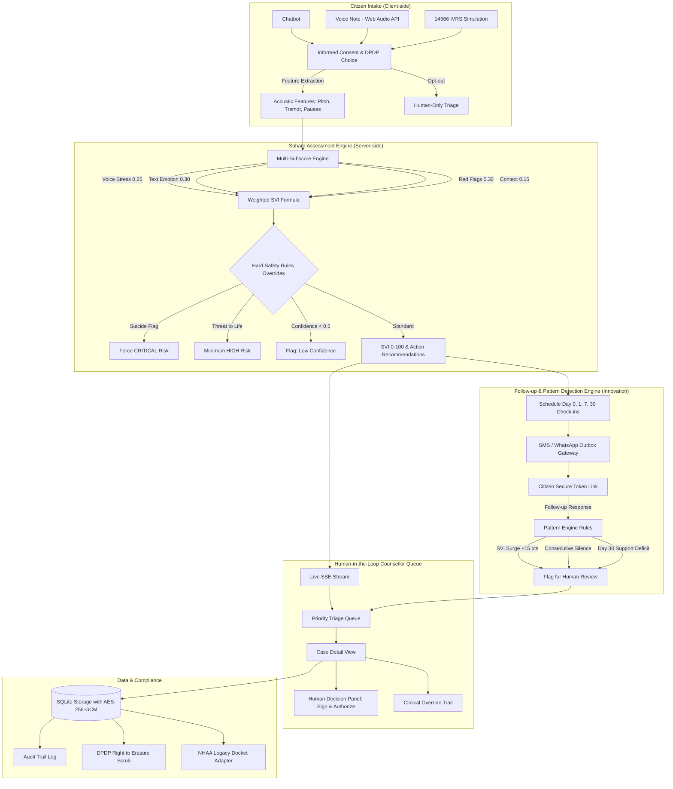

# Sahara AI — NHAA 14566 Distress Helpline & Follow-up Triage System
**Smart India Hackathon 2026** | **Team: Code 2 Care**

> **Core Principle:** *"AI prioritizes. Humans decide."*  
> The AI never takes a final action on its own. Algorithmic scoring assists human counsellors by quantifying acoustic and textual distress, while certified humans authorize and execute all interventions.

---

## 1. Executive Summary

Sahara AI is an AI-powered triage and longitudinal follow-up module integrated into the **National Helpline for Abuse & Aggression (NHAA) 14566**.

Traditional crisis helplines suffer from:
1. **Passive triage**: High cognitive load on counsellors triaging hundreds of calls without objective severity indexing.
2. **Post-call abandonment**: Once a call ends, helplines rarely have automated mechanisms to detect if the victim's situation deteriorates over the following 30 days.

Sahara AI solves this through three pillars:
- **ASSESS**: Computes an objective **Stress Vulnerability Index (SVI, 0–100)** from client-side vocal acoustics (autocorrelation pitch, pitch variance, tremor modulation at 4–12 Hz, speech pauses), multilingual emotion lexicons (English, Hindi, Kannada), red flags, and caller history.
- **RESPOND**: Categorizes cases into four clinical risk bands (**Low, Moderate, High, Critical**) and suggests targeted human pathways (counselling, legal aid, medical assistance, police dispatch, witness protection) with transparent "Why this score" factor breakdowns.
- **FOLLOW-UP & TRACK (Key Innovation)**: Automates scheduled check-ins at **Day 0, Day 1, Day 7, and Day 30**. An intelligent pattern engine automatically flags escalating cases (+15 point surge, consecutive silence, new threats, or broken promises) for urgent human review.

---

## 2. Architecture Diagram



---

## 3. Technology Stack

- **Frontend**: React 19, TypeScript, Tailwind CSS, Recharts, React Router, Lucide Icons
- **Audio Processing**: Web Audio API + MediaRecorder (autocorrelation pitch, RMS energy, 4–12 Hz physiological tremor detector)
- **Backend**: Node.js, Express, TypeScript (`server.ts` mounting Vite in dev)
- **Database**: SQLite (`sql.js`) with schema, migrations, and automatic disk persistence in `data/sahara.sqlite`
- **Security & Privacy**: AES-256-GCM field encryption at rest, DPDP Act 2023 data minimisation (raw audio discarded by default)
- **Realtime Updates**: Server-Sent Events (SSE) `/api/realtime/stream`
- **Testing**: Vitest unit test suite covering scoring calculations, safety rule overrides, and pattern detection

---

## 4. Quick Start & Setup

### Prerequisites
- Node.js (v18+) and npm

### Installation & Run
```bash
# 1. Install dependencies
npm install

# 2. Start both Frontend & Backend (One command starts Express + Vite on port 3000)
npm run dev

# 3. Run unit tests
npm test
```
Access the application at: `http://localhost:3000`

---

## 5. Demo Accounts

| Role | Email | Password | Scope |
| :--- | :--- | :--- | :--- |
| **Citizen Caller** | `citizen@demo.in` | `Demo@1234` | Public intake portal, voice note, check-in |
| **Senior Counsellor** | `counsellor@demo.in` | `Demo@1234` | Priority queue, case detail, decision panel, override |
| **District Admin** | `district@demo.in` | `Demo@1234` | Bengaluru Urban district KPIs, audit logs |
| **State Admin** | `state@demo.in` | `Demo@1234` | State-wide analytics, settings, DPDP controls |

*Note: You can switch between any of these roles in 1 click using the top **SIH 2026 Judge Demo Bar**.*

---

## 6. 3-Minute Walkthrough Script for Judges

### Minute 1: Multimodal Intake & SVI Computation
1. Click **"Access Citizen Help Portal"** on the landing page.
2. Observe **Step 1 (Informed Consent)**: Highlights DPDP Act 2023 compliance with an explicit opt-out choice (*"Continue without AI analysis"*).
3. Switch language to **Hindi** or **Kannada** to demonstrate full i18n support.
4. In **Step 2**, enter: *"He locked me in the room and threatened to kill me if I scream."*
5. Notice the **Intent Classifier** immediately detects an **Urgent Distress Emergency** with high confidence.
6. In **Step 3**, choose **Voice Note**:
   - Click "Start Voice Recording" and speak.
   - Observe the live Web Audio oscilloscope waveform and client-side acoustic feature extraction (Pitch F0, variance, pauses, tremor).
7. Submit the intake and inspect the calm confirmation screen with your **Docket ID** (e.g., `NHAA-2026-1045`).

### Minute 2: Counsellor Triage & Human Decision Panel
1. Click the **"Counsellor Queue"** button in the top bar.
2. Notice the live priority queue ordered by SVI score with risk badges (Critical Red, High Orange, Moderate Amber, Low Green).
3. Click on **Scenario 3 (Ananya Sharma)** or your newly created case:
   - Inspect the **"Why This Score"** transparency panel showing matched threat phrases and acoustic tremor.
   - View the **Sub-scores Radar Chart** (Voice, Text, Red Flags, Context).
   - Review the **AI Recommended Actions** (Police dispatch, safehouse shelter).
4. Scroll to the **Human Decision Panel**:
   - Check the authorized actions, write counsellor directives, and click **"Record & Authorize Human Decision"**.
   - Remind the judges: *"Nothing is executed without a human click."*

### Minute 3: The Follow-up & Pattern Engine (Our Key Innovation)
1. In the top bar, expand **"Time Travel & 4 Scenarios"**.
2. Click **Scenario 4 (Worsening Case: Lakshmi Gowda)**.
3. Review the **Longitudinal SVI Trajectory Chart**:
   - SVI started at 42 (Day 0), rose to 65 (Day 1), and surged to 88 on Day 7 (+23 point jump).
4. Notice the **Active Longitudinal Pattern Flag**: `[Rapid SVI Escalation]`.
5. Visit the **"SMS Outbox"** tab to inspect the simulated citizen messages.
6. Click **"Open Citizen Check-in Link"** on any message to see how the citizen responds on mobile.
7. Click **"+30 Days"** on the Time Machine to watch the scheduler automatically detect silence patterns and support deficits!

---

## 7. Real Implementations vs. Simulated Components

To ensure complete clarity for hackathon judges:

### Real & Fully Implemented:
- **Client-Side Acoustic Feature Extractor**: Uses genuine Web Audio API autocorrelation to extract fundamental pitch ($F_0$), pitch variance, pause ratios, and 4–12 Hz physiological tremor.
- **Multilingual Assessment Engine**: Full rule-based lexicon scoring supporting English, Hindi, and Kannada, complete with negation detection (e.g., *"not scared"*, *"nahi dar rahi"*).
- **Hard-Coded Safety Overrides**: Unit-tested non-negotiable safety rules (suicide indicators force Critical; immediate threats force High).
- **Longitudinal Pattern Engine**: Evaluates multi-day check-in timelines for +15 pt SVI surges, 2 consecutive missed responses, new threats, and Day 30 support deficits.
- **Database & Auth**: True SQLite database (`sql.js`) with 45+ seeded cases, JWT authentication, and AES-256-GCM encrypted PII.
- **Realtime Queue**: Live updates via Server-Sent Events (SSE).
- **Gemini AI Integration**: If `GEMINI_API_KEY` is present, enhances linguistic distress analysis; otherwise gracefully falls back to the local rule engine without failures.

### Simulated for Hackathon Demo:
- **14566 IVRS Telephone Gateway**: Keypad and dial tones simulated in the browser UI, using Web SpeechSynthesis API to simulate recorded phone voice prompts.
- **SMS & WhatsApp Delivery**: Instead of requiring paid Twilio/Telecom DLT SMS credits, outbound messages are logged into the in-app **SMS Outbox Simulator** with direct clickable tokens.
- **Legacy NHAA Central Server**: Integrated via a clean, swappable adapter (`NHAALegacyDocketAdapter`).
